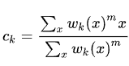

# python_in_cv_middle_task
В рамках данной задачи Вам необходимо продолжить работу с базовым датасетом (см. Лекция 2).
Данные расположены в папке ./dataset.

В рамках реализации задачи Вам необходимо реализовать следующие модули(пакеты):
 - *кодировщик
 - **кластеризатор
 - ***оптимизатор гиперпараметров

Модуль "кодировщик" предоставляет функционал для загрузки и перекодировки данных.
В классе, реализующем данный функционал, обязательна реализация магических методов __getitem__, __len__.
Алгоритм кодировки изображения:
  1. Преобразование изображения в оттенок серого.
  2. Ресайзинг изображения 256*256.
  3. Нормализация значений элементов изображения в диапазоне [0,1].
  4. Декомпозиция изображения на патчи 4х4 (всего 16 патчей - размер выходного вектора патчей, размер патча 64х64). Развертка - линейная.
  5. Построение вектора, представляющего собой результат автокорреляции патчей. Итого 16*16 = 256 элементов.
  6. Бинаризация компонент вектора по порогу (T = 0.5).
  7. Выполнить "зашумление" результата. Для p% элементов выполнить замену на протиповоложное значения. (p = 20%)
  8. Преобразование исходного набора данных в целое число.

 '''
  
    pathes = [1, 1, 1, 1, 1, 1, 1, 1]
    key = sum(bit * (2 ** i) for i, bit in enumerate(reversed(pathes)))

 '''

 Модуль "кластеризатор" представляет функционал для кластеризации данных (разделения данных по группам).
 Алгоритм, реализующий интерфейс кластеризатора, возвращает список центров кластеров и принадлежность каждого элемента данных центроиду.

 В рамках данной реализации Вам необходимо разработать класс, содержащий реализацию алгоритма Нечетких c-средних.
 Параметры алгоритма:
 - количество кластеров c
 - степень "размытости" кластеров m.
 - eps
 Алгоритм:
1. Выбрать количество кластеров C.
2. Случайно присвоить каждой точке данных коэффициенты принадлежности к кластерам из диапазона [0,1].
3. Пока алгоритм не сойдется (то есть изменение коэффициентов между двумя итерациями будет не более  eps):
    1. Вычислить центроид для каждого кластера.
    2. Для каждой точки данных вычислить коэффициент принадлежности к кластерам.
Центроид кластера представляет собой среднее арифметическое всех точек, взвешенное с учетом степени их принадлежности к кластеру.

m = 2 - начальный выбор 
Функция расстояния: L1 (покомпонентная сумма модулей разностей).

Модуль "оптимизатор гиперпараметров" предсталяет функционал для выбора оптимального набора гиперпараметров реализованного алгоритма.
 
В рамках данной задачи Вам необходимо реализовать полный перебор по равномерной сетке значений параметров (см. Лекция 7).
Критерий: минимум суммы разброса значений в кластере при минимальном количестве кластеров.

 Оптимизатор принимает на вход:
  - оптимизируемую функцию (кластеризатор)
  - набор параметров
  - диапазоны допустимых значений каждого параметра
  - delta (шаг, изменение) для каждого параметра

Выходные данные:
 - оптимальные значения параметров
 - результат кластеризации с оптимальными параметрами
 
Модули "кластеризатор" и "оптимизатор" реализовать в виде плагина с динамической загрузкой модулей (см. Лекция 5).
 Реализовать тестовый скрипт, демонстрирующий результат работы реализованного функционала на выбранном наборе данных.
 